# FoodEx

[](http://unmaintained.tech/)
[](https://GitHub.com/Naereen/ama) 
[](https://www.python.org/)
[](https://lbesson.mit-license.org/)

Foodex, a platform that connects people with nearby restaurants to order delicious food on the go. :pizza:

Order food & beverages online from restaurants near & around you. We provide customers with a platform to get food delivered from neighborhood local joints, favorite cafes, luxurious & elite restaurants. Our Platform, Foodex caters to the need for both the hungry foodies and the restaurants, providing a surreal experience for the foodies and an intuitive front end for the restaurant owners to manage their restaurants.

## Contents

* [Modules](#modules-)
* [Tools and framework](#tools-and-framework-)
* [Installation and running](#installation-and-running-)
* [Contributors and maintainers](#contributors-and-maintainers-)


## Modules [&uarr;](#contents)

The FoodEx web app has following modules:
 
For foodies:

* [FoodEx presentation for foodies](#foodex-presentation-for-foodies-) 
* [Sign in to FoodEx for foodies](#sign-in-to-foodex-for-foodies-)
* [Sign up to FoodEx for foodies](#sign-up-to-foodex-for-foodies-)
* [Search nearby restaurants](#search-nearby-restaurants-)
* [Create order](#create-order-)
* [Order checkout](#order-checkout-)
* [Payment gateway](#payment-gateway-)
* [Order history](#order-history-)

For restaurant managers:

* [FoodEx presentation for restaurants](#foodex-presentation-for-restaurants-)
* [Sign in to FoodEx for restaurants](#sign-in-to-foodex-for-restaurants-)
* [Sign up to FoodEx for restaurants](#sign-up-to-foodex-for-restaurants-)
* [View orders](#view-orders-)
* [Restaurant profile](#restaurant-profile-)
* [Edit menu and apply offers](#edit-menu-and-apply-offers-)

### Foodie Modules [&uarr;](#modules-)

#### FoodEx presentation for foodies [&uarr;](#modules-)

On opening the FoodEx webapp the foodies are introduced to a dynamic and eye-catching presentation of FoodEx.
The `cities we service`, `our customer count`, `our achievements`, `media coverage` and other information is provided
in this module. The users can then Sign in or Sign up to the webapp to enjoy our services.

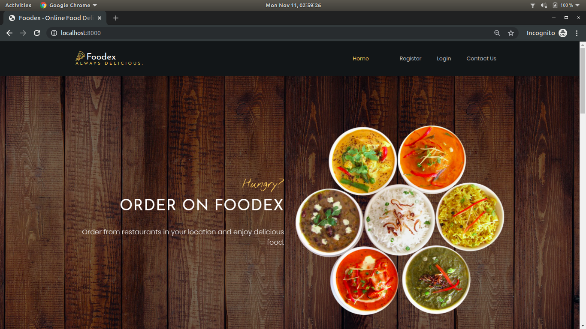

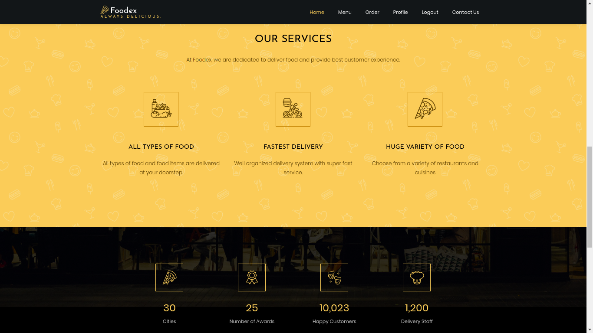

#### Sign in to FoodEx for foodies [&uarr;](#modules-)

The foodies can `sign in` to their accounts on the FoodEx webapp. They need to provide their registered `Email`
and the associated `password` to enjoy our services.

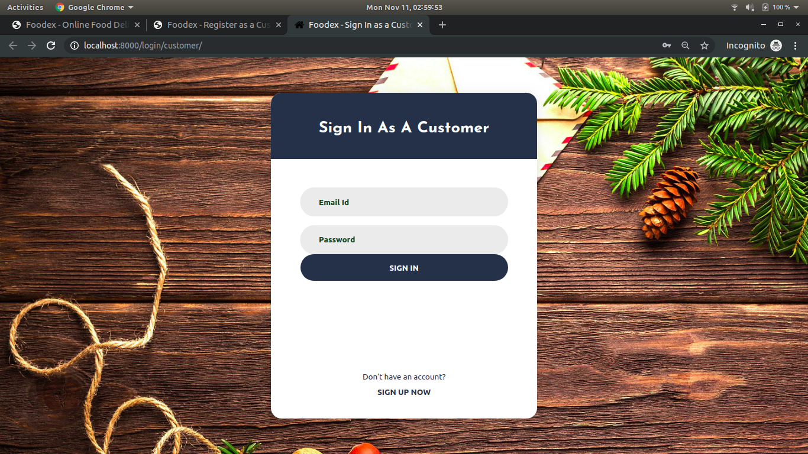

#### Sign up to FoodEx for foodies [&uarr;](#modules-)

The foodies who are new to the webapp can easily join by creating a `free` account using a valid
`email` address. They also need to provide a `secure` and agree to the `Terms and Conditions` of using the FoodEx
webapp. Other details may also be necessary to provide the best service.

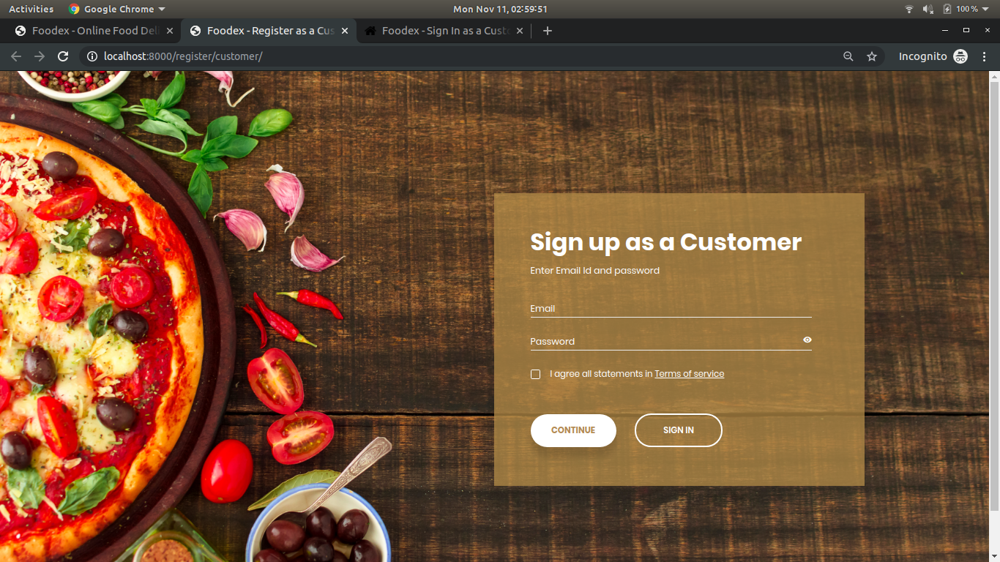

#### Search nearby restaurants [&uarr;](#modules-)

Once signed in the user can easily view the FoodEx restaurants near them. The initial results are based on the location
provided to them during Sign up. However, they can easily modify the search by changing the location in their profiles.

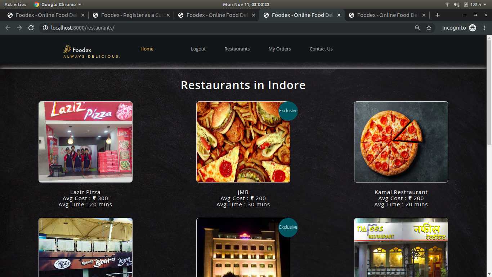

#### Create order [&uarr;](#modules-)

One Clicking on any of the restaurants the foodies can see their menu and also the latest offer provide by the restaurant.
Additional information of the restaurant is also displayed, including, `restaurant name`, `location`, `offered
cuisines`, `average delivery time` and `average order cost`. The details of each and every item on the restaurant's
menu is provide to the foodie, including, `item name`, `item category`, `veg/nonveg info`, `item price`.
The foodies can easily create an order by adding and removing items from their order.

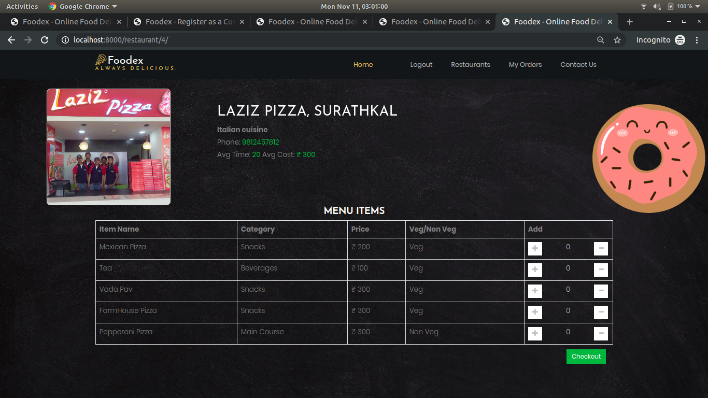

#### Order checkout [&uarr;](#modules-)

Once the foodie has decided on their order they can view a summary of their order before placing it. 
Every items `name`, `quantity`, and total `price` is displayed, The `total order amount`, `tax`, and
`disount` and `effective price` can also be viewed here. Then foodie can also provide and specific instructions
to the restaurants in case they have any. Once they are to ready to place their order they can either decide
to `pay now` or `pay later`.

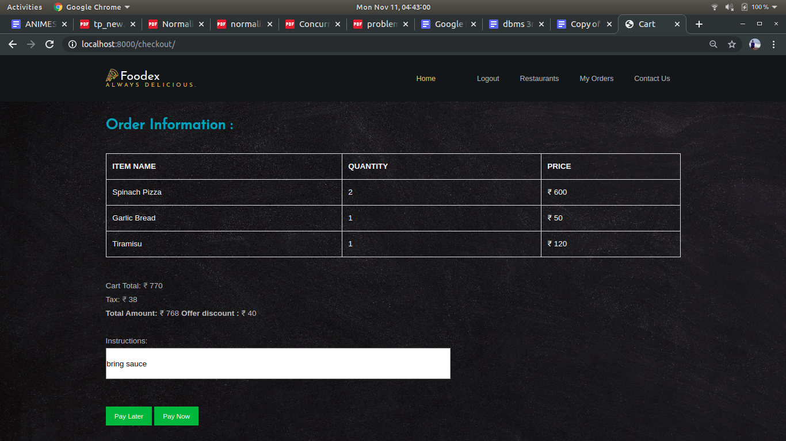

#### Payment gateway [&uarr;](#modules-)

If the foodie wants to `prepay` for their order they are redirected to a payment gateway where they can enter
their `card` details and place the order.

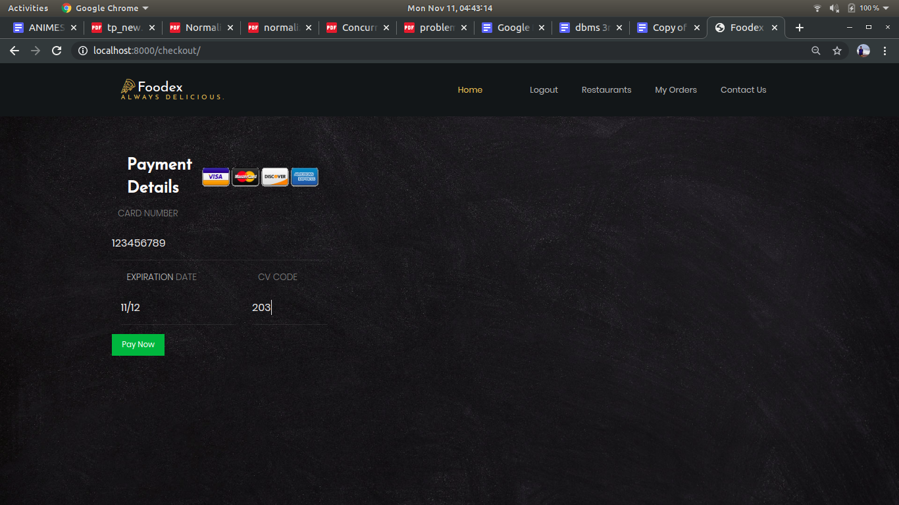

#### Order history [&uarr;](#modules-)

The foodie can view their current and previous order. They can provide rating and reviews with respect to 
their order. We take take their reviews very seriously and even share rating which the restaurant managers
for a direct effect. The foodies can also view the status of their in live time to ensure an on time delivery
of their orders.

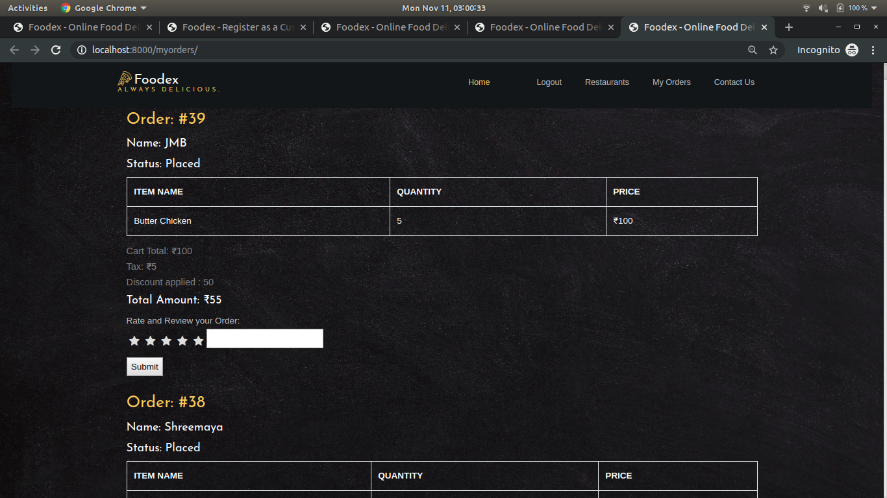


### Restaurant Modules [&uarr;](#modules-)

#### FoodEx presentation for restaurants [&uarr;](#modules-)

On opening the FoodEx webapp the restaurant managers are introduced to a dynamic and eye-catching presentation of FoodEx.
The `cities we service`, `our customer count`, `our achievements`, `media coverage` and other information is provided
in this module. The users can then Sign in or Sign up to the webapp to enjoy our services.


#### Sign in to FoodEx for restaurants [&uarr;](#modules-)

The restaurant managers can `sign in` to their accounts on the FoodEx webapp. They need to provide their registered `Email`
and the associated `password` to enjoy our services.

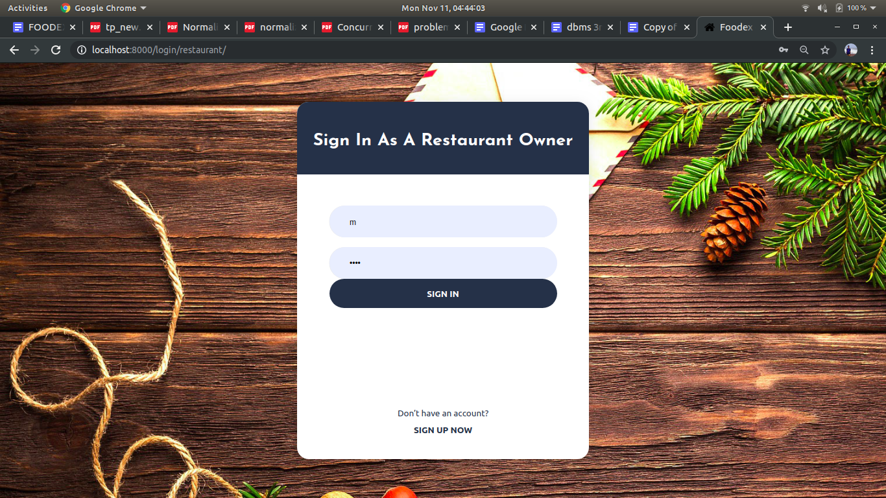

#### Sign up to FoodEx for restaurants [&uarr;](#modules-)

The restaurants who are not yet registered on the FoodEx webapp, their managers can easily do so  by creating an account using a valid
`email` address. They also need to provide a `secure` and agree to the `Terms and Conditions` of using the FoodEx
webapp. Other details of the restaurant are necessary to ensure a hassle free registration.

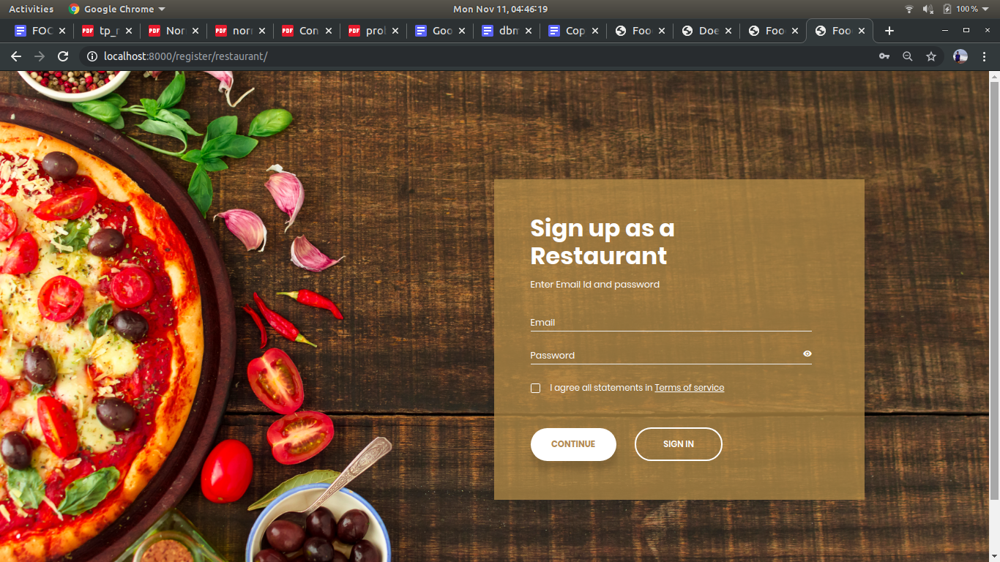

#### View orders [&uarr;](#modules-)

The restaurants can easily manage their order by viewing the order details. The order details include the following information:

* Order Number
* Name of the foodie
* Contact number of the foodie
* Item Summary: Item names, quantity and price.
* Order Summary: Total amount, tax, discount and effective price. 
* Review

The restaurant manager can change the `status` of their order. This info is shared in live time with the respective foodie.  

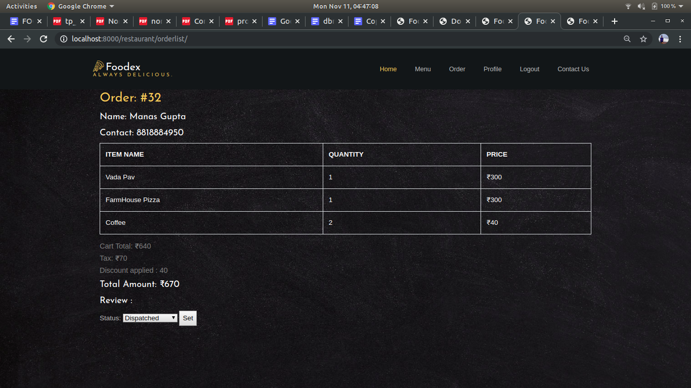

#### Restaurant profile [&uarr;](#modules-)

The restaurant manager can view and update the profile of the restaurant. This information is updates in the search screen of
the foodies in real time.

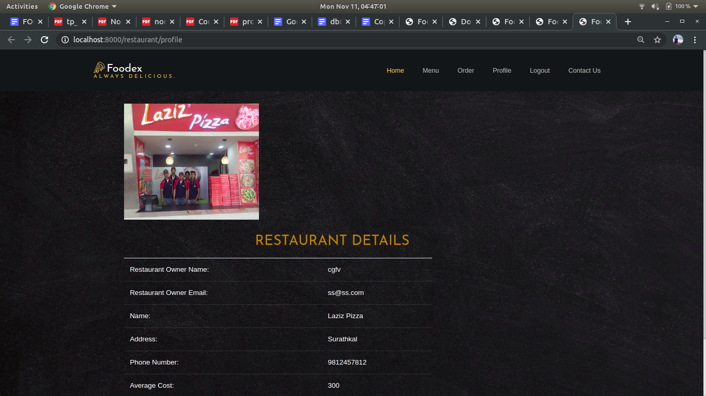


#### Edit menu and apply offers [&uarr;](#modules-)

The restaurant manager can modify their menu. This include `adding`, `modifying` and deleting items from their
menu. The also `add` and `apply` offers of their choice to provide the foodies.

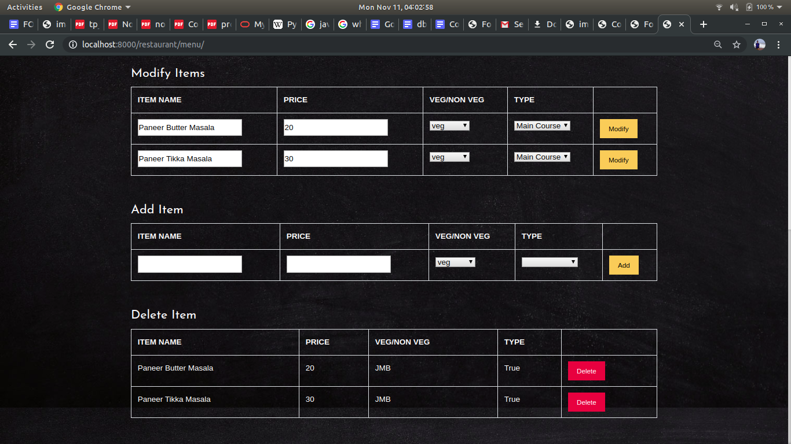


## Tools and framework [&uarr;](#contents)

Following tools and framework are used in this project:

* [PyCharm](#pycharm-)
* [HTML](#html-)
* [CSS](#css-)
* [JavaScript](#javascript-)
* [MySQL](#mysql-)
* [Python](#python-)
* [Django framework](#django-framework-)

#### PyCharm [&uarr;](#tools-and-framework-)

PyCharm is a Python IDE with a complete set of tools for Python development.
In addition, the IDE provides capabilities for professional Web development using the Django framework.
PyCharm is an integrated development environment used in computer programming, specifically for the Python language.
It is developed by the Czech company JetBrains. PyCharm can be installed by downloading the required version for your
system from the official [JetBrains website](https://www.jetbrains.com/pycharm/download/).

#### HTML [&uarr;](#tools-and-framework-)

Hypertext Markup Language is the standard markup language for documents designed to be displayed in a web browser.
It can be assisted by technologies such as Cascading Style Sheets and scripting languages such as JavaScript.
First developed by Tim Berners-Lee in 1990, HTML is short for Hypertext Markup Language. No installation needed

#### CSS [&uarr;](#tools-and-framework-)

Cascading Style Sheets is a style sheet language used for describing the presentation of a document written in a markup language like HTML.
CSS is a cornerstone technology of the World Wide Web, alongside HTML and JavaScript.
CSS stands for Cascading Style Sheets.
CSS describes how HTML elements are to be displayed on the screen, paper, or in other media.
CSS saves a lot of work. It can control the layout of multiple web pages all at once. No installation needed

#### JavaScript [&uarr;](#tools-and-framework-)

JavaScript, often abbreviated as JS, is a high-level, interpreted scripting language that conforms to the ECMAScript specification.
JavaScript has curly-bracket syntax, dynamic typing, prototype-based object-orientation, and first-class functions.
JavaScript is a dynamic computer programming language.
It is lightweight and most commonly used as a part of web pages, whose implementations allow client-side script to interact with the user and make dynamic pages.
No installation is needed. 

#### MySQL [&uarr;](#tools-and-framework-)

MySQL is one of the best RDBMS being used for developing various web-based software applications.
MySQL is developed, marketed and supported by MySQL AB, which is a Swedish company.
With its proven performance, reliability, and ease-of-use, MySQL has become the leading database choice for web-based applications.
It can be easily installed using the below command for linux systems.

```
    sudo apt update
    sudo apt install mysql-server
    sudo mysql_secure_installation
```

#### Python [&uarr;](#tools-and-framework-)

Python is an interpreted, high-level, general-purpose programming language.
Created by Guido van Rossum and first released in 1991, Python's design philosophy emphasizes code readability with its notable use of significant whitespace.
Its language constructs and object-oriented approach aim to help programmers write clear, logical code for small and large-scale projects.
Python comes pre-installed in linux distributions. Otherwise it can be easily installed using the below commands.

```
sudo apt-get update && sudo apt-get -y upgrade
sudo apt-get install python3
```

To check whether python has been successfully installed run the command `python3 -V` you should see the below output.

`python 3.5.2
`

#### Django framework [&uarr;](#tools-and-framework-)

Django is a high-level Python Web framework that encourages rapid development and clean, pragmatic design.
Built by experienced developers, it takes care of much of the hassle of Web development, so you can focus on writing your app without needing to reinvent the wheel. 
It's free and open source. Ridiculously fast. It is maintained by the Django Software Foundation, an independent organization established as a 501 non-profit.
Django's primary goal is to ease the creation of complex, database-driven websites.
Django can be installed on a linux system by running the below commands.

```
sudo apt-get install -y python3-pip
pip3 install virtualenv
mkdir django-apps
cd django-apps 
virtualenv env
. env/bin/activate
pip install django
django-admin --version
```

Once successfully installed you should see the below output.

```
Output
2.0.1
```


## Installation and running [&uarr;](#contents)

To run the FoodEx web app make sure you have installed all the dependencies mentioned in this [section](#tools-and-framework-).
Once all the dependencies are installed clone the [foodex]() repository. Modify the database setting by
going to [settings.py](./foodapp/settings.py) and changing the `USER`, `PASSWORD`, `HOST` and `PORT` to
the corresponding settings of your MQL installation. Run the app by using the below command.
```
python manage.py runserver` 
```
Point your browser to the following URL and voila the you have the FoodEX app running
```
http://localhost:8080`
```
## Contributors and maintainers [&uarr;](#contents)

This project and repository is created and maintained by:

* **Manas Gupta**

 Email: manasgupta1109@gmail.com
    
 Github: [manas11](https://github.com/manas11)
    
* **Aashay Maheshwarkar**

 Email: aashaym1@gmail.com
    
 Github: [aashaym1](https://github.com/aashaym1)
